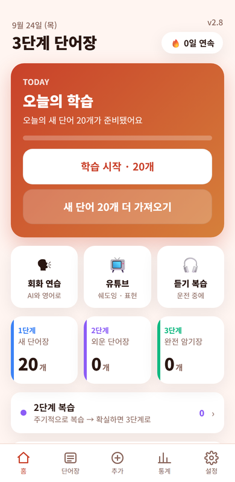
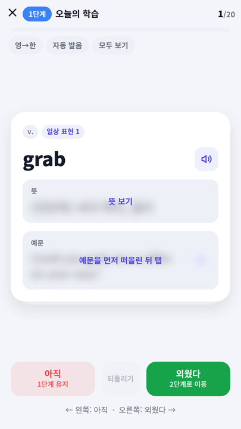
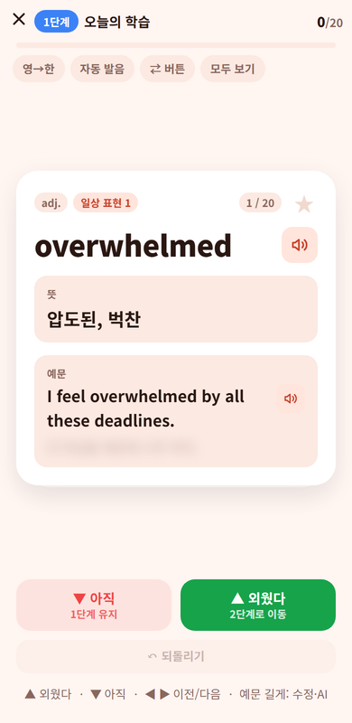
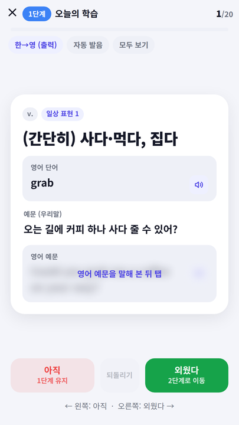
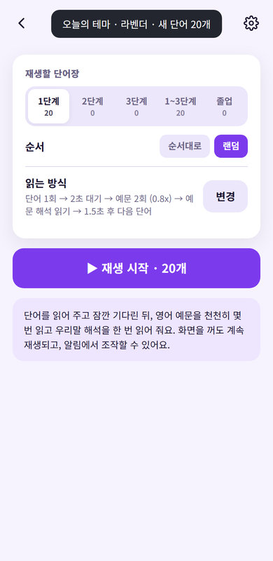
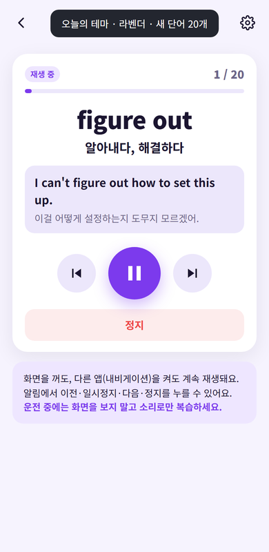
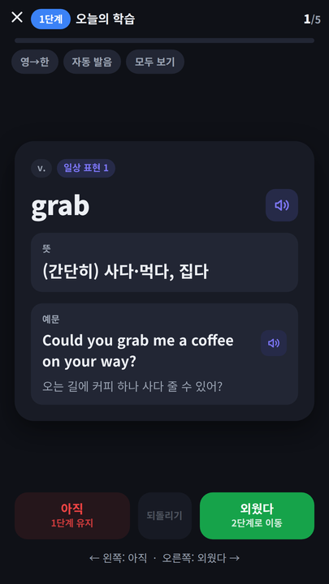

# 3단계 단어장 (Vocab3)

예문까지 말할 수 있을 때만 다음 단계로 넘기는 **3단계 단어장 시스템** 기반 영어 단어 학습 안드로이드 앱입니다.
회원가입·광고·인터넷 권한 없이 완전히 오프라인으로 동작합니다.

가수 박진영이 소개한 "새 단어장 → 외운 단어장 → 완전 암기장" 공부법에서 착안했습니다.

<p>
   
</p>
<p>
   
</p>

## 기능

- **3단계 단어장** — 매일 새 단어 N개(기본 20)가 1단계에 채워지고, 외운 단어는 2단계(외운 단어장) → 3단계(완전 암기장) → 졸업으로 올라갑니다.
- **카드 학습** — 뜻과 예문은 가려져 있어 먼저 떠올린 뒤 탭으로 확인(예문 칸: 영어 → 해석 → 가림 순환). 위로 스와이프 = 외웠다, 아래로 = 아직, 좌우 = 이전/다음 카드. 되돌리기, 학습 순서 랜덤.
- **한→영 출력 모드** — 우리말만 보고 영어 단어와 예문을 말해 보는 훈련.
- **발음** — 기기 TTS로 단어·예문 재생, 자동 발음 옵션.
- **듣기 복습** — 단어 → 대기 → 영어 예문 ×N(천천히) → 우리말 해석 순으로 읽어 주는 백그라운드 재생. 화면을 꺼도, 다른 앱을 켜도 이어지고 알림에서 이전/일시정지/다음/정지. 읽는 횟수·속도·대기 시간 설정 가능. 운전 중 귀로 복습하는 용도.
- **단어 관리** — 직접 추가, `단어 | 뜻 | 예문 | 해석` 형식 일괄 붙여넣기, 단계 이동, 검색, 백업/복원(파일·클립보드·공유).
- **통계** — 연속/최장 학습일·외움률 타일, 최근 14일 외움/아직 막대, 12주 학습 히트맵, 단계별 단어 분포, 자주 틀린 단어.
- 기본 단어 200개(회화 필수 표현 10테마), 다크 모드, 연속 학습일.

## 설치

[Releases](../../releases)에서 최신 APK를 받아 설치합니다 (Android 7.0 이상, "출처를 알 수 없는 앱" 허용 필요).

## 구조

이 앱은 Gradle/Android Studio 없이 빌드되도록 만들어졌습니다.

```
AndroidManifest.xml
src/kr/hyunuk/vocab3/MainActivity.java   WebView 래퍼 + JS 브릿지 (TTS·저장·공유·진동·파일·뒤로가기·시스템바)
src/kr/hyunuk/vocab3/ReviewService.java  듣기 복습용 포그라운드 서비스 (TTS 시퀀서, 알림 제어, 오디오 포커스)
assets/index.html, style.css, app.js     앱 UI/로직 (순수 HTML/CSS/JS, 프레임워크 없음)
assets/words.js                          기본 단어 200개
res/                                     아이콘·테마·문자열
tools/                                   아이콘 생성(Pillow), Playwright UI 테스트, 스토어 이미지 생성, SDK 다운로드
store/                                   Google Play 등록용 문구·개인정보처리방침·가이드
build.sh                                 APK/AAB 빌드 스크립트
```

데이터는 `SharedPreferences`에 JSON 한 덩어리로 저장되며(키 `vocab3.state.v1`), 웹 UI는 브라우저에서 `assets/index.html`을 열어도 localStorage/브라우저 TTS로 그대로 동작합니다.

## 빌드 (Linux)

```bash
sudo apt install aapt dalvik-exchange zipalign apksigner default-jdk-headless   # Debian/Ubuntu 패키지
./tools/setup-sdk.sh        # android-34.jar, android-36.jar, bundletool.jar → ./sdk
./build.sh                  # → build/vocab3.apk (+ build/vocab3.aab)
```

- `aapt2`·`dx`·`zipalign`·`apksigner`는 Debian/Ubuntu 패키지로 설치되는 것을 씁니다 (Android SDK 매니저 불필요).
- 서명 키가 없으면 디버그 키를 자동 생성합니다. 배포용은 `KS=keystore/release.jks KS_PASS=... ./build.sh` 처럼 지정하세요. `keystore/`는 `.gitignore`에 포함되어 있습니다.
- 업데이트를 올리려면 `AndroidManifest.xml`의 `versionCode`/`versionName`을 올리고 같은 키로 서명해야 합니다.
- Google Play 업로드용 AAB는 `sdk/bundletool.jar`가 있을 때 함께 만들어집니다 (targetSdk 36).

## 테스트

웹 UI는 Playwright로 자동 테스트합니다 (Chromium 필요).

```bash
npm install
npx playwright install chromium
npm test
```

## 단어 데이터 형식

`assets/words.js`의 각 항목은 `[단어, 품사, 뜻, 예문, 예문 해석, 테마]`입니다. 앱 안에서는 한 줄에 `단어 | 뜻 | 예문 | 해석 | 품사(선택)` 형식으로 여러 단어를 한 번에 가져올 수 있습니다.

## 라이선스

[MIT](LICENSE)
