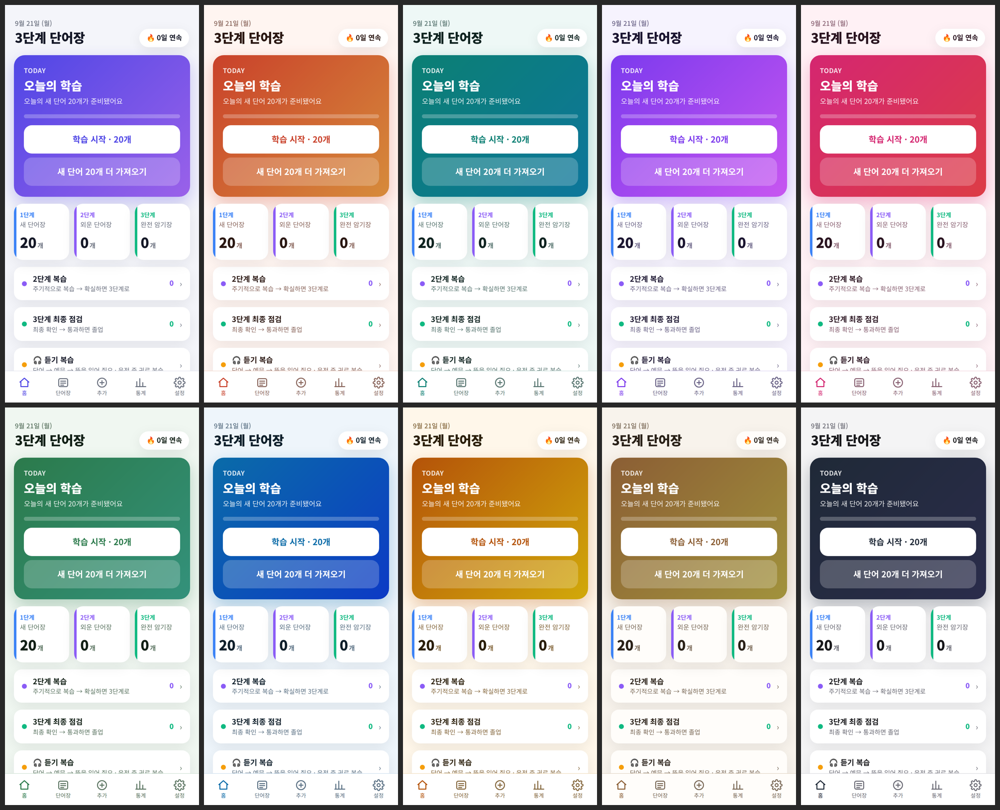
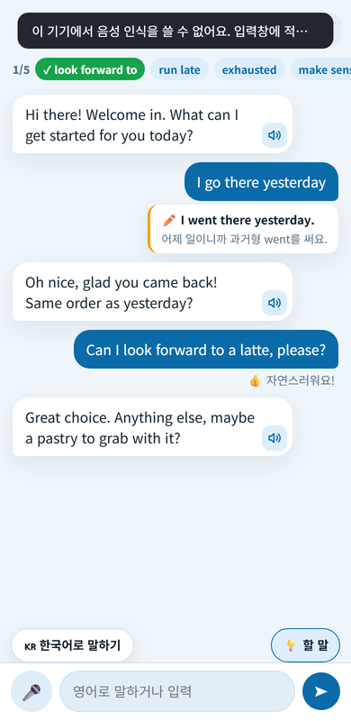
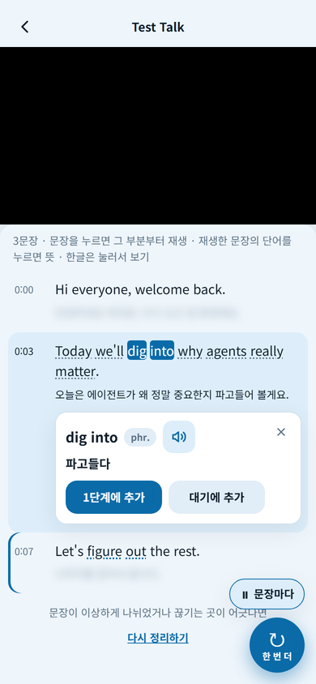
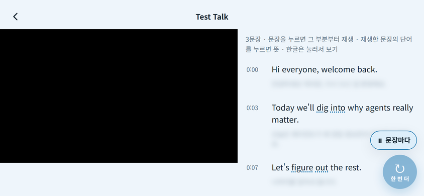

# 3단계 단어장 (Vocab3)

예문까지 말할 수 있을 때만 다음 단계로 넘기는 **3단계 단어장 시스템** 기반 영어 단어 학습 안드로이드 앱입니다.
회원가입·광고 없이 오프라인으로 동작합니다 (선택 기능인 AI 예문 생성을 쓸 때만 본인 Gemini API 키로 Google API에 접속).

가수 박진영이 소개한 "새 단어장 → 외운 단어장 → 완전 암기장" 공부법에서 착안했습니다.

<p>
   
</p>
<p>
    
</p>
<p>
  
</p>

## 기능

- **3단계 단어장** — 매일 새 단어 N개(기본 20)가 1단계에 채워지고, 외운 단어는 2단계(외운 단어장) → 3단계(완전 암기장) → 졸업으로 올라갑니다.
- **카드 학습** — 뜻과 예문은 가려져 있어 먼저 떠올린 뒤 탭으로 확인(예문 칸: 영어 → 해석 → 가림 순환). 위로 스와이프 = 외웠다, 아래로 = 아직, 좌우 = 이전/다음 카드. 되돌리기, 학습 순서 랜덤.
- **한→영 출력 모드** — 우리말만 보고 영어 단어와 예문을 말해 보는 훈련.
- **영어 문장 공부 (v2.12)** — 졸업한 단어의 예문(v2.17부터 유튜브에서 꾹 눌러 담은 문장도)을 한글로 먼저 보여 주고, 탭하면 가려 둔 영어가 보이며 읽어 줘요. 위로 밀면 쉬움·아래로 밀면 어려움 — 어려운 문장일수록 가중치가 쌓여 더 자주 나오고, 멈출 때까지 계속 이어져요.
- **발음** — 기기 TTS로 단어·예문 재생, 자동 발음 옵션.
- **듣기 복습** — 단어 → 대기 → 영어 예문 ×N(천천히) → 우리말 해석 순으로 읽어 주는 백그라운드 재생. 화면을 꺼도, 다른 앱을 켜도 이어지고 알림에서 이전/일시정지/다음/정지. 읽는 횟수·속도·대기 시간 설정 가능. 운전 중 귀로 복습하는 용도.
- **단어 관리** — 직접 추가, `단어 | 뜻 | 예문 | 해석` 형식 일괄 붙여넣기, 단계 이동, 검색, 백업/복원(파일·클립보드·공유).
- **통계** — 연속/최장 학습일·외움률 타일, 최근 14일 외움/아직 막대, 12주 학습 히트맵, 단계별 단어 분포, 자주 틀린 단어. v2.13: 앱 사용 시간 — 오늘·최근 7일 평균, 최근 14일 막대(누르면 그날), 기능별(단어 학습·문장 공부·회화·유튜브·듣기 복습·기타) 시간과 횟수(카드·문장·유튜브 재생·회화 말하기). 앱이 화면에 떠 있는 시간만 셉니다.
- **예문 수정 + AI 예문 (Gemini)** — 학습 카드의 예문을 길게 누르면 바로 고칠 수 있고, 설정에 본인 Gemini API 키를 넣으면 "✨ AI 새 예문"으로 상황(예: 회의에서)에 맞는 예문과 해석을 받아 옵니다. 키는 기기에만 저장되고 저장소·백업에는 절대 포함되지 않습니다.
- **회화 연습 (Gemini)** — 상황(카페·회의·여행·일상·자유)을 고르면 AI가 상대 역할로 대화를 이끕니다. 마이크로 말하면 기기 음성 인식이 텍스트로 바꾸고, 문장마다 한 줄 교정, 오늘 외운 단어를 미션으로 써 보기, 끝나면 평가·교정 목록·기억할 표현을 단어장에 추가. 지난 연습 리포트(대화 전문 포함)는 "최근 연습"에서 다시 볼 수 있어요. v2.0: 틀린 문장은 AI가 대화 흐름 속에서 자연스럽게 고쳐 말하고(교정 박스와 병행), AI 답변 아래 한글 번역(흐림 → 탭), 미션 단어 칩을 누르면 뜻·예문 팝업, "한국어로 말하기" 버튼으로 한국어 → 영어 번역 후 전송, ★ 중요 단어가 미션에 먼저 나와요. v2.1: 대화 화면의 💡 버튼으로 "할 말 알려주기"를 대화 중에 바로 켜고 끌 수 있어요(켜면 지금 답변에 맞는 문장 2개가 곧바로 떠요).
- **유튜브 쉐도잉 (Gemini)** — 홈의 "유튜브"에서 영상 링크를 넣으면 Gemini가 영상을 듣고 영어 문장을 시간순으로 정리합니다(한글 해석은 가려 두고 누르면 보임, 익힐 표현은 밑줄). 문장을 누르면 앱 안 유튜브 플레이어가 그 시점부터 재생하고 "문장마다 멈춤"으로 한 문장씩 따라 말하기(쉐도잉), 재생한 문장의 단어를 누르면 뜻이 나오고 1단계·대기 단어장에 바로 추가. 공개 영상만 되며, 재생은 YouTube API 서비스(YouTube 약관·Google 개인정보처리방침 적용)를 씁니다. v2.3: 문장은 끝까지 한 문장으로(화면 자막 줄바꿈 무시) 정리하고 문장 끝 시간에서 멈춰요(다음 문장까지 안 읽음). v2.17: 문장을 꾹 누르면 선택창 — 📚 영어 문장 공부에 넣기(졸업 단어 예문과 함께 나옴, 가중치 똑같이), 📋 복사, ⤒⤓ 앞·뒤 문장과 합치기, ✂ 쪼개기(나눌 단어를 누름), 바로 되돌리기. v2.16: 화면에 박힌 자막을 따라 한 문장이 여러 줄로 쪼개지던 것을 . ? ! 로 끝날 때까지 되붙여요(이미 정리한 영상도 앱을 열 때 한 번, 다시 정리하지 않고). v2.15: 받은 영상은 화면을 탭하면 멈추고 다시 탭하면 이어서 재생(표시 없이), 제목줄의 📌로 영상을 맨 위에 고정하면 목록을 올려도 영상이 가려지지 않아요(세로 화면). v2.14: 링크를 넣으면 폰이 360p 영상을 직접 받아 앱 안에만 저장해 두고(안드로이드 13 이상), 유튜브 플레이어 대신 앱 플레이어로 재생해요 — 유튜브 화면 요소가 없고 오프라인에서도 쉐도잉. 받은 소리의 파형으로 문장 시작·끝을 실제 조용한 곳에 자동으로 맞춰요(손으로 고친 시간이 우선). 예전 영상은 "⬇ 오프라인 저장". v2.11: 가로 화면에서 영상 아래 "✎ 문장 시간 수정"으로 누른 문장의 시작·끝을 0.1·0.5초씩 또는 "지금"(영상 위치)으로 고쳐 저장(고친 문장은 ✎ 표시, 그 자리에서 정확히 재생·멈춤), 문장을 꾹 누르면 영어 문장 복사, 멈출 때 영상 위에 뜨는 제목줄·"동영상 더보기"를 안 보이게. v2.9: 문장 시간을 더 정확하게 — Gemini 가 조금 생각하고(생각 모드) 영상을 1초에 2장씩 보며 정리해요(예전 영상은 "다시 정리하기"). v2.8: 새로 정리할 땐 "Yes."·"Right." 같은 아주 짧은 문장(3단어 이하)을 가까운 앞뒤 문장에 합쳐요. v2.7: 문장 끝에서 정확히 멈추고, 재생 중엔 영상 위 조작 버튼이 뜨지 않아요. v2.6: 영상 화면에서 폰을 가로로 돌리면 왼쪽 영상 · 오른쪽 스크립트. v2.5: 1분 넘는 곳부터 문장 시간이 어긋나던 문제 수정(예전 영상은 "다시 정리하기"). v2.4: 영상은 맨 위 제자리에 있고, 목록을 올리면 문장이 영상 위를 덮어 화면을 넓게 써요(따라다니는 창 없음). "한 번 더"·"문장마다" 버튼은 오른쪽 아래(오른손 엄지). 예전에 정리한 영상은 "다시 정리하기"로 새 규칙 적용.
- **단어장 목록** — 단어·뜻 한 줄 + 영어 예문 + 해석을 펼쳐 보기(접기 가능).
- **색 테마 10종** — 인디고·코랄 선셋·딥 틸·라벤더·로즈·포레스트·오션 블루·앰버 허니·웜 샌드·그래파이트(라이트/다크 각각). 새 단어가 채워질 때마다 랜덤으로 바뀌고(끌 수 있음), 설정에서 직접 고를 수도 있어요.
- 기본 단어 200개(회화 필수 표현 10테마), 연속 학습일. v2.0: 학습 카드 ★ 중요 표시, 완료 화면 축하 연출(컨페티·효과음·연속 학습일 신기록), 단어 추가는 여러 단어 붙여넣기가 기본(단어만 적어도 AI가 뜻·예문·해석을 채움), 홈 빠른 실행(회화·단어 추가·듣기).

## 설치

[Releases](../../releases)에서 최신 APK를 받아 설치합니다 (Android 7.0 이상, "출처를 알 수 없는 앱" 허용 필요).

## 구조

이 앱은 Gradle/Android Studio 없이 빌드되도록 만들어졌습니다.

```
AndroidManifest.xml
src/kr/hyunuk/vocab3/MainActivity.java   WebView 래퍼 + JS 브릿지 (TTS·음성인식·Gemini HTTP·저장·공유·진동·파일·뒤로가기·시스템바)
src/kr/hyunuk/vocab3/ReviewService.java  듣기 복습용 포그라운드 서비스 (TTS 시퀀서, 알림 제어, 오디오 포커스)
assets/index.html, style.css, app.js     앱 UI/로직 (순수 HTML/CSS/JS, 프레임워크 없음)
assets/words.js                          기본 단어 200개
res/                                     아이콘·테마·문자열
tools/                                   아이콘 생성(Pillow), Playwright UI 테스트, 스토어 이미지 생성, SDK 다운로드
store/                                   Google Play 등록용 문구·개인정보처리방침·가이드
build.sh                                 APK/AAB 빌드 스크립트
```

데이터는 `SharedPreferences`에 JSON 한 덩어리로 저장되며(키 `vocab3.state.v1`), 웹 UI는 브라우저에서 `assets/index.html`을 열어도 localStorage/브라우저 TTS로 그대로 동작합니다.

## 빌드

```bash
./tools/setup-sdk.sh        # android-34.jar, android-36.jar, bundletool.jar → ./sdk, 라이브러리 jar(SHA-256 검증) → ./sdk/libs
./build.sh                  # → build/vocab3.apk (+ build/vocab3.aab)
```

- 윈도우는 `powershell -ExecutionPolicy Bypass -File tools/setup-sdk.ps1`(JDK 17 · Android SDK build-tools · jar)을 한 번 실행한 뒤 Git Bash에서 `bash build.sh`.
- v2.14부터 라이브러리(NewPipeExtractor 등)가 Java 11 바이트코드라 Android SDK build-tools의 **d8**이 필요합니다 (Debian 패키지의 `dx`로는 빌드되지 않음).
- 서명 키가 없으면 디버그 키를 자동 생성합니다. 배포용은 `KS=keystore/release.jks KS_PASS=... ./build.sh` 처럼 지정하세요. `keystore/`는 `.gitignore`에 포함되어 있습니다.
- 업데이트를 올리려면 `AndroidManifest.xml`의 `versionCode`/`versionName`을 올리고 같은 키로 서명해야 합니다.
- Google Play 업로드용 AAB는 `sdk/bundletool.jar`가 있을 때 함께 만들어집니다 (targetSdk 36).

## 테스트

웹 UI는 Playwright로 자동 테스트합니다 (Chromium 필요).

```bash
npm install
npx playwright install chromium
npm test
```

## 단어 데이터 형식

`assets/words.js`의 각 항목은 `[단어, 품사, 뜻, 예문, 예문 해석, 테마]`입니다. 앱 안에서는 한 줄에 `단어 | 뜻 | 예문 | 해석 | 품사(선택)` 형식으로 여러 단어를 한 번에 가져올 수 있습니다.

## 라이선스

소스 코드는 [MIT](LICENSE)입니다. v2.14부터 배포 APK에는 NewPipeExtractor(GPL-3.0-or-later) 등이 들어가므로 **배포 APK는 GPL-3.0-or-later 조건**입니다 — [THIRD_PARTY_NOTICES.md](THIRD_PARTY_NOTICES.md), [COPYING.GPL-3.0.txt](COPYING.GPL-3.0.txt).

**부탁:** 이 앱은 개인 학습용으로 만들었습니다. 상업적으로 이용(판매·유료 서비스·광고 수익 등)하지 말아 주세요. 이 부탁은 위 라이선스에 조건을 더하는 것이 아니며 법적 구속력은 없습니다 (GPL 은 추가 제한을 허용하지 않습니다).
